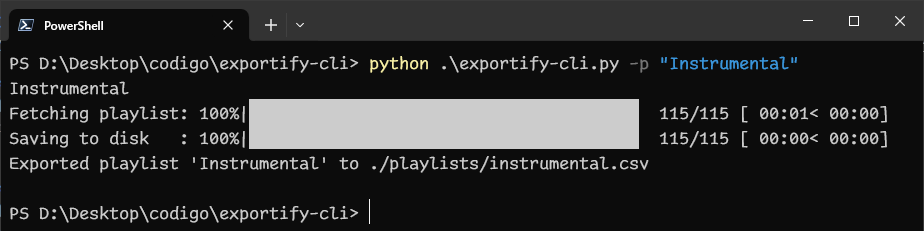

# exportify-cli



Export Spotify playlists to CSV or JSON directly from the terminal, inspired by [pavelkomarov/exportify](https://github.com/pavelkomarov/exportify).

This tool can export all saved playlists, including liked songs.

## Installation:

**You can also download a binary from the [releases page](https://github.com/donmerendolo/exportify-cli/releases/latest) and skip steps 1 and 2.**

Requires Python 3.13+.

1. **Clone this repository:**

```bash
git clone https://github.com/donmerendolo/exportify-cli.git
```

2. **Install the required packages:**

```bash
cd exportify-cli
uv sync
```

You can then run the tool with `uv run exportify-cli`, or install it globally as a uv tool:

```bash
uv tool install .
```

3. **Set up Client ID and Redirect URI:**

Create a Spotify app in the [Spotify Developer Dashboard](https://developer.spotify.com/dashboard/applications) and copy its Client ID and Redirect URI. The first time you run exportify-cli, it will guide you through the setup and create `config.toml` for you:

```
No valid config found. Creating "C:\Users\USERNAME\.config\exportify-cli\config.toml".
Use a Client ID and Redirect URI that belong to the same Spotify app.

Spotify Client ID: 
Redirect URI: 
Enter the URL you were redirected to: 
```

If you wish to log out, run:

```bash
exportify-cli --logout
```

You may also revoke access in https://www.spotify.com/us/account/apps/.

---

## Configuration:

Configuration lives in a TOML file (`config.toml`). It is looked up in this order:

1. `./config.toml` (current directory)
2. Next to the program (frozen binary)
3. `$XDG_CONFIG_HOME/exportify-cli/config.toml` (usually `~/.config/exportify-cli/config.toml`), where a new one is created if none exists

Legacy `config.cfg` files from previous versions are migrated to `config.toml` automatically (the old file is kept).

Default values for most options can be changed in `config.toml`, including `playlists` and `users` arrays that are exported when no `-a`/`-p`/`-u` is given on the command line.

---

## Usage:

```
Usage: exportify-cli (-a | -p NAME|ID|URL|URI [-p ...] | -u ID|URL|URI | -l
| --logout) [OPTIONS]

  Export Spotify playlists to CSV or JSON.

Options:
    -a, --all                     Export all playlists
    -p, --playlist NAME|ID|URL|URI
                                  Export a Spotify playlist given name, ID,
                                  URL, or URI; repeatable.
    -u, --user ID|URL|URI         Export all public playlists of a Spotify
                                  user given ID, URL, or URI; repeatable.
    -l, --list                    List available playlists.
    --logout                      Delete cached Spotify auth token and exit.
    -c, --config PATH             Path to configuration file (default:
                                  ./config.toml or
                                  ~/.config/exportify-cli/config.toml).
    -o, --output PATH             Directory to save exported files (default is
                                  ./playlists); '-' writes to stdout.
    -f, --format [csv|json]       Output file format (defaults to 'csv');
                                  repeatable.
    --uris                        (Deprecated: add the URI fields to --fields
                                  or the config instead.)
    --external-ids                (Deprecated: add 'Track ISRC'/'Album UPC' to
                                  --fields or the config instead.)
    --no-bar                      Hide progress bar.
    --sort-key TEXT               Key to sort tracks by (default is
                                  'spotify_default').
    --reverse                     Reverse the sort order.
    --fields TEXT                 Comma-separated list of fields to include.
  -h, --help                      Show this message and exit.
  -v, --version                   Show the version and exit.
```

- Default values can be changed in `config.toml`.
- Playlists (and users) to export can be set in `config.toml` via the `playlists` and `users` arrays, overridden by `--playlist`/`--user` when given.
- Playlist names support partial matching, provided they uniquely identify a single playlist.
- You can also export a playlist that's not saved in your library by using its ID, URL, or URI.
- A single command can export multiple playlists by using the `-p` option multiple times. Same applies for the `-u` option.
- You can export all ***public*** playlists of any user by using the `-u` option with their user ID, URL, or URI. It won't save Liked Songs from that user, as it's private.
- The default fields are: `Position`, `Track Name`, `Album Name`, `Artist Name(s)`, `Release Date`, `Duration_ms`, `Popularity`, `Added By`, `Added At`, `Record Label`. All available fields are: `Position`, `Track URI`, `Artist URI(s)`, `Album URI`, `Track Name`, `Album Name`, `Artist Name(s)`, `Release Date`, `Duration_ms`, `Popularity`, `Added By`, `Added At`, `Record Label`, `Track ISRC`, `Album UPC`. If you want any other field to be added, feel free to open an issue or PR.
- Use `--fields` (or the `fields` array in `config.toml`) to choose the exact columns and their order. It accepts either the full header names above or these short aliases: `position`, `uri` (`track_uri`), `artist_uris`, `album_uri`, `name`, `album`, `artist`, `date`, `duration`, `popularity`, `added_by`, `added_at`, `label`, `isrc`, `upc`. Unknown names are warned about and skipped.
- Use `-o -` to write the export to stdout instead of files.

### Examples:

```bash
# List all saved playlists
exportify-cli --list

# Export all saved playlists, including liked songs
exportify-cli --all

# Export playlist whose name is "COCHE" to JSON in reverse order
exportify-cli -p COCHE -f json --reverse

# Export playlist whose ID is "2VqAIceMCzBRhzq6zVmDZw" to current directory, sorted by Added At
exportify-cli -p 2VqAIceMCzBRhzq6zVmDZw --output . --sort-key "Added At"

# Export playlist with its URL to both JSON and CSV
exportify-cli -f json -f csv -p https://open.spotify.com/playlist/2VqAIceMCzBRhzq6zVmDZw?si=16df8ae16c2d492b

# Export playlists "Instrumental" and "COCHE" to CSV without progress bar, sorted by Popularity
exportify-cli -p instr -p COCHE -f csv --no-bar --sort-key "popularity"

# Export only the track name, artist, and date added, in that column order
exportify-cli -p COCHE --fields "name,artist,added_at"

# Print a playlist as CSV to stdout
exportify-cli -p COCHE -o -

# Export all public playlists of user with ID "spotifyuser123" and user with URL "https://open.spotify.com/user/anotheruser456"
exportify-cli -u spotifyuser123 -u https://open.spotify.com/user/anotheruser456
```

---

## Development:

Run the tests with:

```bash
uv run pytest
```

## Building:

You can use [PyInstaller](https://pyinstaller.readthedocs.io/en/stable/) to build a binary (it's no longer a project dependency, so install it separately):

```bash
uv run --with pyinstaller pyinstaller --onefile --name exportify-cli src/exportify_cli/cli.py
```
