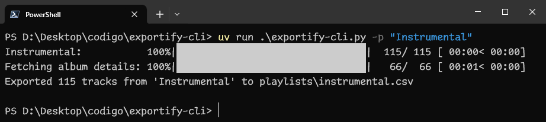

# exportify-cli


Export Spotify playlists to CSV or JSON directly from the terminal, inspired by [pavelkomarov/exportify](https://github.com/pavelkomarov/exportify).

This tool can export all saved playlists, including liked songs.

## Installation:
**You can also download a binary from the [releases page](https://github.com/donmerendolo/exportify-cli/releases/latest) and skip steps 1 and 2. It's recommended to place it in a dedicated folder since it will create .cache, a config file and playlists folders.**
1. **Clone this repository:**
```bash
git clone https://github.com/donmerendolo/exportify-cli.git
```

2. **Install the required packages:**
(recommended to use a virtual environment)
```bash
cd exportify-cli
pip install -r requirements.txt
```

3. **Set up Client ID, Client Secret and Redirect URI:**

The first time you run exportify-cli, it will guide you through the setup:
```
File "config.cfg" not found or invalid. Let's create it.

1. Go to Spotify Developer Dashboard (https://developer.spotify.com/dashboard).
2. Create a new app.
3. Set a name and description for your app.
4. Add a redirect URI (e.g. http://127.0.0.1:3000/callback).

Now after creating the app, press the Settings button on the upper right corner.
Copy the Client ID, Client Secret and Redirect URI and paste them below.
```

After running `python exportify-cli.py` (or [one of the binaries](https://github.com/donmerendolo/exportify-cli/releases/latest)) the first time, it should keep you authenticated so you don't have to log in each time.

If you wish to log out, simply remove the `.cache` file (you may also have to remove access to `exportify-cli` in https://www.spotify.com/us/account/apps/).

---

## Usage:
```
Usage: exportify-cli.py (-a | -p NAME|ID|URL|URI [-p ...] | -u ID|URL|URI |
-l) [OPTIONS]

  Export Spotify playlists to CSV or JSON.

Options:
    -a, --all                     Export all playlists
    -p, --playlist NAME|ID|URL|URI
                                  Export a Spotify playlist given name, ID,
                                  URL, or URI; repeatable.
    -u, --user ID|URL|URI         Export all public playlists of a Spotify
                                  user given ID, URL, or URI; repeatable.
    -l, --list                    List available playlists.
    -c, --config PATH             Path to configuration file (default is
                                  ./config.cfg next to this script).
    -o, --output PATH             Directory to save exported files (default is
                                  ./playlists).
    -f, --format [csv|json]       Output file format (defaults to 'csv');
                                  repeatable.
    --uris                        Include album and artist URIs.
    --external-ids                Include track ISRC and album UPC.
    --no-bar                      Hide progress bar.
    --sort-key TEXT               Key to sort tracks by (default is
                                  'spotify_default').
    --reverse                     Reverse the sort order.
  -h, --help                      Show this message and exit.
  -v, --version                   Show the version and exit.
```

- Default values can be changed in `config.cfg`.

- Playlist names support partial matching, provided they uniquely identify a single playlist.

- You can also export a playlist that's not saved in your library by using its ID, URL, or URI.

- A single command can export multiple playlists by using the `-p` option multiple times. Same applies for the `-u` option.

- You can export all ***public*** playlists of any user by using the `-u` option with their user ID, URL, or URI. It won't save Liked Songs from that user, as it's private.

- The default fields are: `Position`, `Track URI`, `Track Name`, `Album Name`, `Artist Name(s)`, `Release Date`, `Duration_ms`, `Popularity`, `Added By`, `Added At`, `Record Label`. With flags, `Album URI(s)`, `Artist URI(s)`, `Track ISRC` and `Album UPC` can be included too. If you want any other field to be added, feel free to open an issue or PR.

### Examples:
```
# List all saved playlists
python exportify-cli.py --list

# Export all saved playlists, including liked songs with Artist and Album URIs
exportify-cli.exe --all --uris

# Export playlist whose name is "COCHE" to JSON in reverse order
python exportify-cli.py -p COCHE -f json --reverse

# Export playlist whose ID is "2VqAIceMCzBRhzq6zVmDZw" to current directory, sorted by Added At
exportify-cli.exe -p 2VqAIceMCzBRhzq6zVmDZw --output . --sort-key "Added At"

# Export playlist with its URL to both JSON and CSV
exportify-cli.exe -f json -f csv -p https://open.spotify.com/playlist/2VqAIceMCzBRhzq6zVmDZw?si=16df8ae16c2d492b

# Export playlists "Instrumental" and "COCHE" to CSV without progress bar, sorted by Popularity
python exportify-cli.py -p instr -p COCHE -f csv --no-bar --sort-key "popularity"

# Export all public playlists of user with ID "spotifyuser123" and user with URL "https://open.spotify.com/user/anotheruser456"
python exportify-cli.py -u spotifyuser123 -u https://open.spotify.com/user/anotheruser456
```

---

## Building:
You can use [PyInstaller](https://pyinstaller.readthedocs.io/en/stable/) to build a binary with this command:
```bash
pyinstaller --onefile .\exportify-cli.py
```
